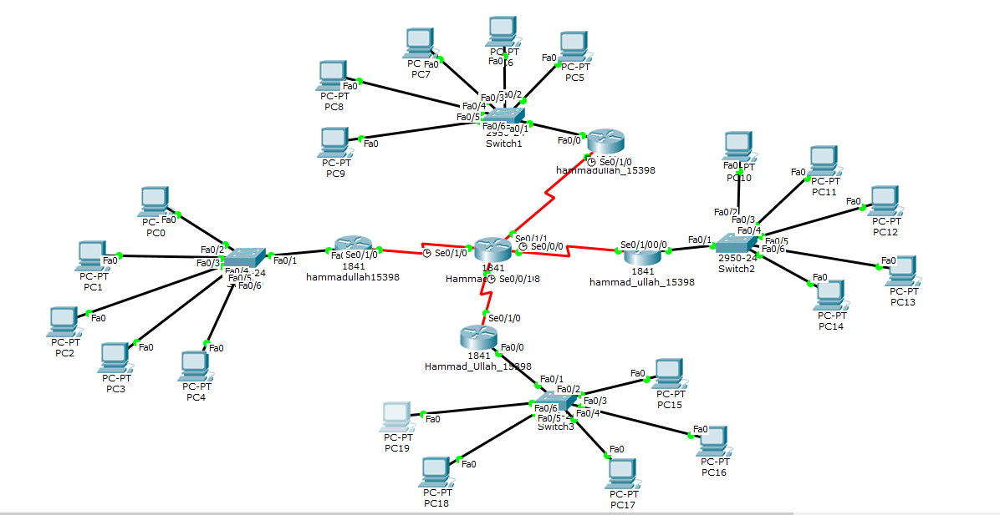

# DCN Assignment 1: DHCP on a 5-Router Hub Network

## Topology

One central router is connected to four branch routers with serial links. Each branch router has a switch and five PCs (20 PCs in total) and works as the DHCP server for its own LAN.

## Addressing

**Central router**

| Interface | Address | Connects to |
|---|---|---|
| Se0/1/0 | 10.10.10.1 | Branch 1 |
| Se0/1/1 | 20.20.20.1 | Branch 2 |
| Se0/0/0 | 30.30.30.1 | Branch 3 |
| Se0/0/1 | 40.40.40.1 | Branch 4 |

**Branch routers**

| Branch | Serial | LAN gateway (Fa0/0) | DHCP network | PCs |
|---|---|---|---|---|
| Branch 1 | 10.10.10.2 | 192.168.1.1 | 192.168.1.0/24 | PC0 to PC4 |
| Branch 2 | 20.20.20.2 | 172.168.1.1 | 172.168.0.0/16 | PC5 to PC9 |
| Branch 3 | 30.30.30.2 | 191.168.1.1 | 191.168.0.0/16 | PC10 to PC14 |
| Branch 4 | 40.40.40.2 | 128.168.1.1 | 128.168.0.0/16 | PC15 to PC19 |

## What was done
- Configured the serial links and the LAN interfaces on all five routers
- On each branch router: excluded the first addresses, created a DHCP pool with the network and default gateway
- Switched the PCs to DHCP and checked that each got an address, mask and gateway

## Files
- [assignment1-report.pdf](assignment1-report.pdf): report with screenshots
- `assignment1-dhcp.pkt`: Packet Tracer file
