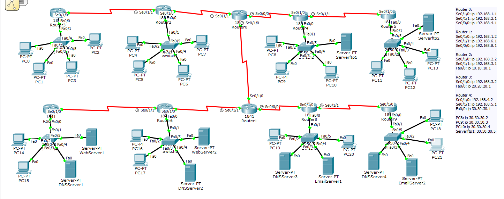

# DCN Assignment 2: Multi-Service Network with 10 Routers

## Topology

A larger network of 10 routers and 22 PCs. Two core routers (Router0 and Router1) are linked to each other and to two chains of routers on each side. Every router has its own LAN with a switch, PCs and in most cases a server.

## Services configured

| Service | Where | What was tested |
|---|---|---|
| **DHCP** | Routers with PC LANs | PCs received addresses automatically |
| **FTP** | Router4 and Router5 LANs (Serverftp1, Serverftp2) | Login, `put`, `get` and `rename` from PCs |
| **DNS** | DNSServer1 to DNSServer4 | Domain names mapped to the web and email servers |
| **Web (HTTP)** | WebServer1 and WebServer2 (Router7 and Router6 LANs) | Custom pages opened by domain name from PCs |
| **Email (SMTP/POP3)** | EmailServer1 and EmailServer2 (Router8 and Router9 LANs) | Mail sent and received between PCs (PC19 and PC20, PC21 and PC18) |

## Notes
- For the email test, an extra PC was added in the Router8 and Router9 LANs so mail could be exchanged between two clients next to their own mail and DNS servers.
- The full IP list for every router and host is in the report.

## Files
- [assignment2-report.pdf](assignment2-report.pdf): report with screenshots
- `assignment2-multi-service.pkt`: Packet Tracer file
