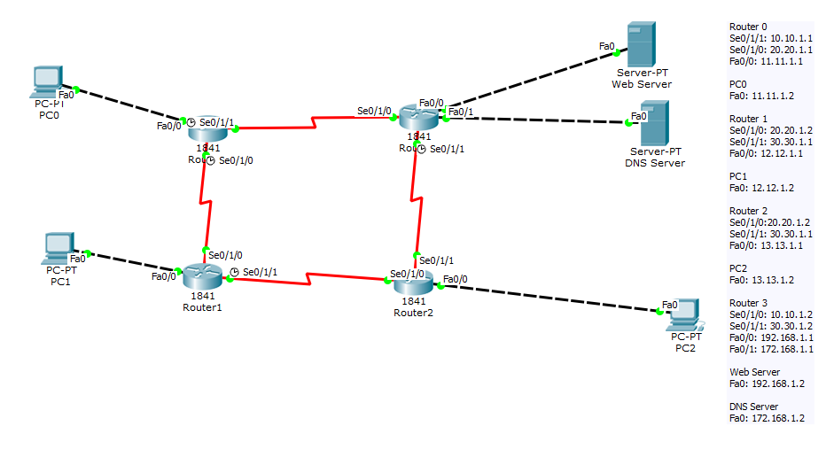

# DCN Lab 10: DNS and Web Server

## Topology

Four routers connected with serial links. Three routers each have a LAN with one PC. The fourth router has the **Web Server** and the **DNS Server** on separate LANs.

| Host | Address |
|---|---|
| PC0 | 11.11.1.2 |
| PC1 | 12.12.1.2 |
| PC2 | 13.13.1.2 |
| Web Server | 192.168.1.2 |
| DNS Server | 172.168.1.2 |

## What was done
- Edited the web server page (`index.html`) with a custom welcome message
- Added a DNS record on the DNS server that maps `www.hammadullah15398.com` to the web server
- Set the DNS server address on the PCs
- Opened `http://www.hammadullah15398.com` in the browser of PC0, PC1 and PC2

## Result
All three PCs load the custom page by domain name, so DNS resolution and HTTP both work across the routers (screenshots in the report).

## Files
- [lab10-report.pdf](lab10-report.pdf): report with screenshots
- `lab10-dns-web.pkt`: Packet Tracer file
