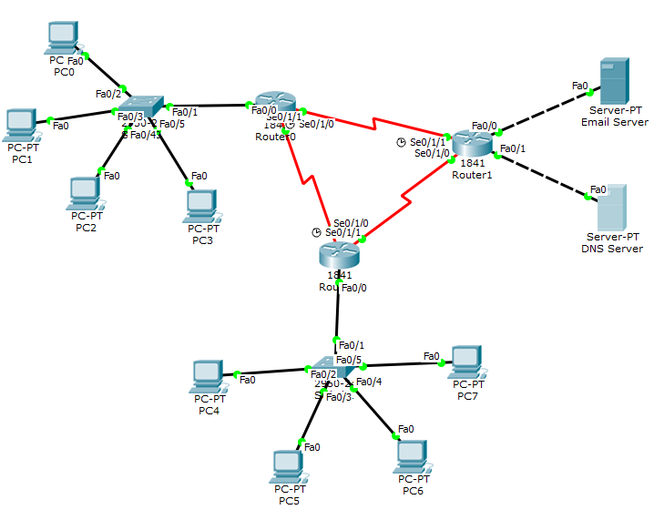

# DCN Lab 11: Email Server and DNS

## Topology

Three routers in a triangle. Router0 and Router2 each have a LAN with PCs (PC0 to PC3 and PC4 to PC7). Router1 hosts the **Email Server** and the **DNS Server**.

## What was done
- Configured the email service (SMTP and POP3) with a mail domain and user accounts such as `PC1@gmail.com` and `PC4@gmail.com`
- Added a DNS record so the mail domain resolves to the email server
- Configured the mail client on the PCs (Desktop, Email) with the mail server names and DNS server
- Sent a mail from **PC1 to PC4** (subject "DCN Lab11") and received it on PC4
- Sent a mail from **PC4 to PC1** (subject "Hammadullah15398") and received it on PC1

## Result
The mail client logs show `Send Success` and `Receive Mail Success`, including the DNS lookup of the mail server name (screenshots in the report).

## Files
- [lab11-report.pdf](lab11-report.pdf): report with screenshots
- `lab11-email-dns.pkt`: Packet Tracer file
