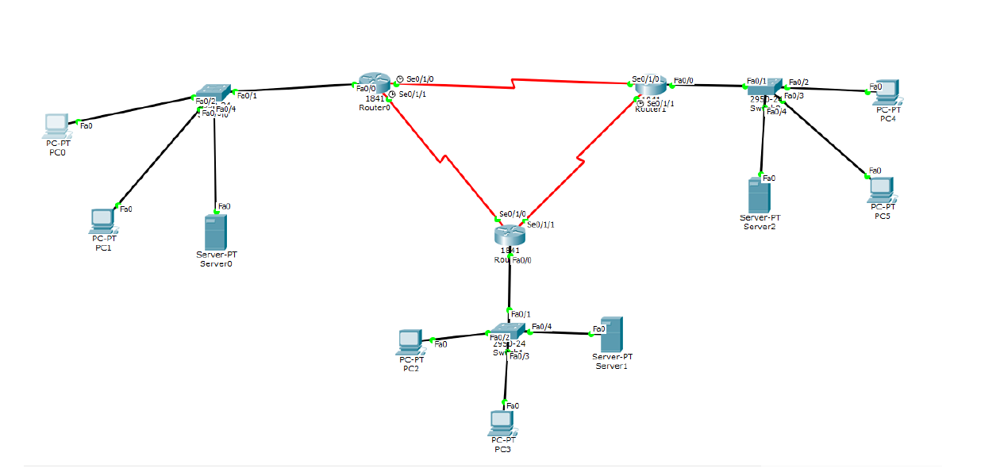

# DCN Lab 2: Multi-Router Network with Web Servers

## Topology

Three Cisco 1841 routers (Router0, Router1, Router2) are connected to each other with serial links.
Each router has its own LAN: a 2950-24 switch with PCs and a server.

| LAN | Devices |
|---|---|
| Router0 LAN | PC0, PC1, Server0 |
| Router1 LAN | PC4, PC5, Server2 |
| Router2 LAN | PC2, PC3, Server1 |

## What was done
- Built the topology: routers, switches, PCs and servers
- Connected devices with straight-through cables (LAN) and serial links (between routers)
- Opened the Packet Tracer web page from each PC using the browser on the Desktop tab:
  - PC0 and PC1 → `http://11.11.1.4`
  - PC2 and PC3 → `http://12.12.1.4`
  - PC4 and PC5 → `http://13.13.1.4`

## Files
- [lab2-report.pdf](lab2-report.pdf): report with topology and browser screenshots
- `lab2-web-servers.pkt`: Packet Tracer file
