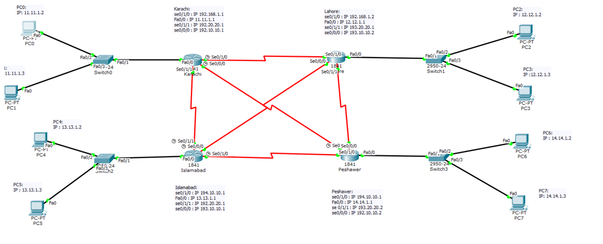

# DCN Lab 3: IP Addressing on a 4-Router Network

## Topology

Four routers named after cities (**Karachi, Lahore, Islamabad, Peshawar**) are connected in a full mesh using six serial links.
Each router also has a LAN: one switch with two PCs.

## Addressing plan

**Serial links (mask 255.255.255.0)**

| Link | Network | Interfaces |
|---|---|---|
| Karachi – Lahore | 192.168.1.0 | .1 (Karachi se0/1/0), .2 (Lahore se0/1/0) |
| Karachi – Islamabad | 192.20.20.0 | .1 (Karachi se0/1/1), .2 (Islamabad se0/1/1) |
| Karachi – Peshawar | 192.10.10.0 | .1 (Karachi se0/0/0), .2 (Peshawar se0/0/0) |
| Lahore – Peshawar | 193.20.20.0 | .1 (Lahore se0/1/1), .2 (Peshawar se0/1/1) |
| Lahore – Islamabad | 193.10.10.0 | .2 (Lahore se0/0/0), .1 (Islamabad se0/0/0) |
| Islamabad – Peshawar | 194.10.10.0 | .1 (Islamabad se0/1/0), .2 (Peshawar se0/1/0) |

**LANs (mask 255.0.0.0)**

| Router (Fa0/0) | PCs |
|---|---|
| Karachi: 11.11.1.1 | PC0 11.11.1.2, PC1 11.11.1.3 |
| Lahore: 12.12.1.1 | PC2 12.12.1.2, PC3 12.12.1.3 |
| Islamabad: 13.13.1.1 | PC4 13.13.1.2, PC5 13.13.1.4 |
| Peshawar: 14.14.1.1 | PC6 14.14.1.2, PC7 14.14.1.3 |

## What was done
- Configured IP addresses on every serial and FastEthernet interface from the router CLI (`interface`, `ip address`, `no shutdown`)
- Assigned static IP addresses to all 8 PCs
- Verified the configuration:
  - Each PC pings its own gateway router with 0% packet loss
  - 20 ICMP test packets in the PDU list show `Successful` between directly connected routers and PCs ([pdu-list.png](pdu-list.png))

## Scope
This lab covers IP addressing and interface configuration. Routing (static routes, OSPF, EIGRP) is not part of this lab.

## Files
- [lab3-practical-report.pdf](lab3-practical-report.pdf): configuration and ping screenshots
- [lab3-theory-report.pdf](lab3-theory-report.pdf): Ethernet cables, UTP/STP, Cat5/Cat6, RJ-45, crimping
- `lab3-ip-addressing.pkt`: Packet Tracer file
