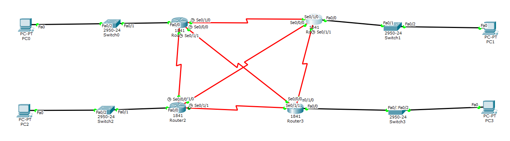

# DCN Lab 4: Remote Access to Routers with Telnet

## Topology

Four Cisco 1841 routers (Router0 to Router3) are connected with serial links. Each router has a LAN with a 2950-24 switch and one PC (PC0 to PC3).

## What was done
- Built the 4-router topology and configured the interfaces
- Set a Telnet (VTY) password on the routers
- Opened a remote session from each PC with `telnet <router IP>`:

| PC | Command |
|---|---|
| PC0 | `telnet 11.0.0.1` |
| PC1 | `telnet 12.0.0.1` |
| PC2 | `telnet 13.0.0.1` |
| PC3 | `telnet 14.0.0.1` |

## Result
Each session shows `Trying ... Open`, the `User Access Verification` password prompt, and then the router prompt (`Router>`), which confirms remote access works.

## Files
- [lab4-report.pdf](lab4-report.pdf): report with screenshots
- `lab4-telnet.pkt`: Packet Tracer file
