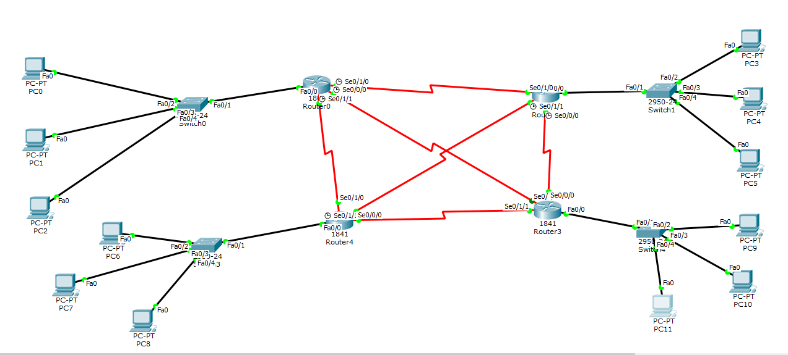

# DCN Lab 5: Telnet to Routers and Connection Troubleshooting

## Topology

Four routers, each with a switch and three PCs (12 PCs in total).

## Tasks

**1. Telnet from every PC to its router**

| PCs | Router address |
|---|---|
| PC0, PC1, PC2 | `telnet 11.0.0.1` |
| PC3, PC4, PC5 | `telnet 12.0.0.1` |
| PC6, PC7, PC8 | `telnet 13.0.0.1` |
| PC9, PC10, PC11 | `telnet 14.0.0.1` |

All sessions reach the router prompt after the password.

**2. Addressing problem with four PCs**
Four PCs connected in pairs with IPs 192.168.1.1, 192.168.1.2, 192.168.2.1 and 192.168.2.2 (mask 255.255.255.0). Two PCs that are directly connected must be in the same subnet, so each pair uses one network (192.168.1.0 and 192.168.2.0).

**3. Why Telnet fails between a PC and a router (red link)**
The PC was connected with a console cable. Console is for local management only. Telnet needs an IP network connection (an Ethernet link with an IP address on the router interface).

**4. Why a Server and a Router do not link (red link)**
A router and a server both use the same type of Ethernet port, so a straight-through cable between them does not work. The fix is a switch in the middle (straight-through cables to the switch), or a crossover cable for a direct link.

## Files
- [lab5-report.pdf](lab5-report.pdf): report with screenshots
- `lab5-telnet-troubleshooting.pkt`: Packet Tracer file
