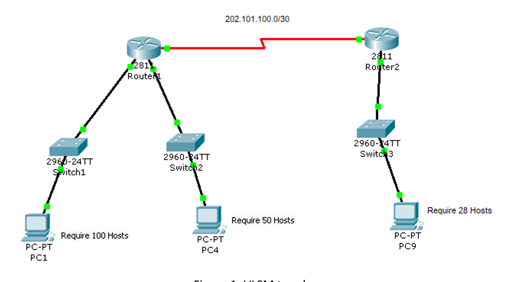
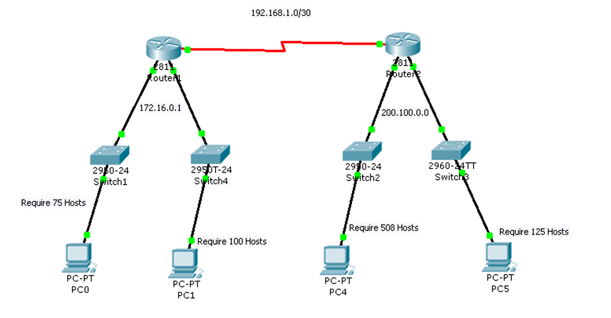
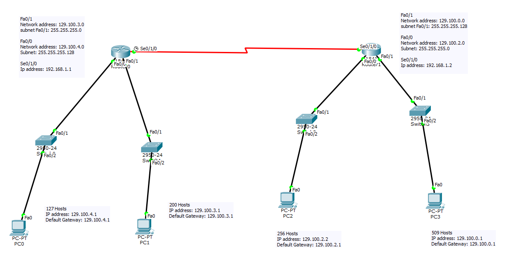

# DCN Lab 7: Subnetting and VLSM

Subnet design for networks with different host requirements. The calculations are done by hand and attached in the report (network address, first host, last host, broadcast, subnet mask).

## Method
1. Find the smallest block that fits the hosts: `2^n - 2 >= hosts`
2. Prefix length = `32 - n`
3. Allocate the largest subnets first so blocks do not overlap
4. Point-to-point router links use `/30` (2 usable hosts)

## Exercise 1: Class C (202.101.100.0)

Requirements: 100, 50 and 28 hosts plus a serial link.

| Hosts needed | Prefix | Mask | Subnet |
|---|---|---|---|
| 100 | /25 | 255.255.255.128 | 202.101.100.0 |
| 50 | /26 | 255.255.255.192 | 202.101.100.128 |
| 28 | /27 | 255.255.255.224 | 202.101.100.192 |
| Serial link | /30 | 255.255.255.252 | 202.101.100.224 |

## Exercise 2: Class B and Class C

Requirements: 75 and 100 hosts (172.16.0.0), 508 and 125 hosts (200.100.0.0), and a serial link (192.168.1.0/30).

| Hosts needed | Prefix | Mask |
|---|---|---|
| 75 | /25 | 255.255.255.128 |
| 100 | /25 | 255.255.255.128 |
| 508 | /23 | 255.255.254.0 |
| 125 | /25 | 255.255.255.128 |

## Exercise 3: Lab task (Class B, 129.100.0.0)

A larger VLSM design with 127, 200, 256 and 509 host requirements, built in Packet Tracer. See the report for the calculations.

## Files
- [lab7-report.pdf](lab7-report.pdf): tables and handwritten calculations
- `lab7-vlsm.pkt`: Packet Tracer file
