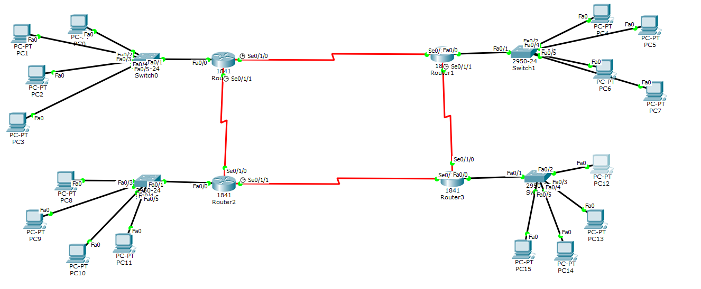

# DCN Lab 8: DHCP on a 4-Router Network

## Topology

Four Cisco 1841 routers connected with serial links. Each router has a switch and four PCs (PC0 to PC15). Each router acts as the DHCP server for its own LAN.

## Address pools

| LAN | PCs | Pool network | Default gateway |
|---|---|---|---|
| Router0 | PC0 to PC3 | 192.168.1.0 | 192.168.1.1 |
| Router1 | PC4 to PC7 | 172.168.0.0 | 172.168.1.1 |
| Router2 | PC8 to PC11 | 128.100.0.0 | 128.100.100.1 |
| Router3 | PC12 to PC15 | 191.50.0.0 | 191.50.50.1 |

## Result
PCs are set to DHCP and each one shows `DHCP request successful` with its address, mask and default gateway (screenshots in the report).

## Files
- [lab8-report.pdf](lab8-report.pdf): report with screenshots
- `lab8-dhcp.pkt`: Packet Tracer file
