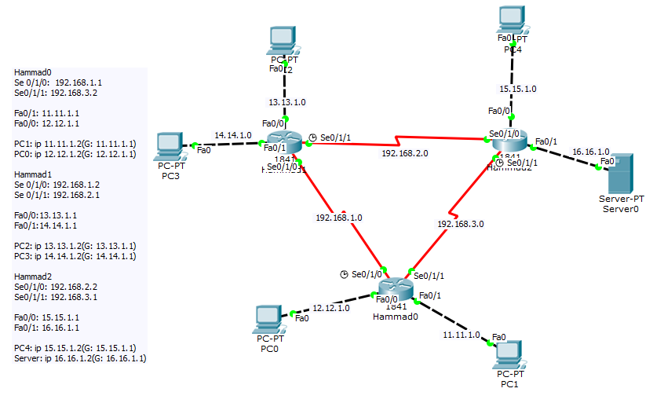

# DCN Lab 9: FTP Server

## Topology

Three routers (Hammad0, Hammad1, Hammad2) connected in a triangle with serial links. Each router has two LANs. The FTP server sits behind Hammad2.

| Link | Network |
|---|---|
| Hammad0 to Hammad1 | 192.168.1.0 |
| Hammad1 to Hammad2 | 192.168.2.0 |
| Hammad2 to Hammad0 | 192.168.3.0 |

| Host | Address | Gateway |
|---|---|---|
| PC1 | 11.11.1.2 | 11.11.1.1 |
| PC0 | 12.12.1.2 | 12.12.1.1 |
| PC2 | 13.13.1.2 | 13.13.1.1 |
| PC3 | 14.14.1.2 | 14.14.1.1 |
| PC4 | 15.15.1.2 | 15.15.1.1 |
| Server0 (FTP) | 16.16.1.2 | 16.16.1.1 |

## What was done
- Turned on the FTP service on Server0 and created user accounts with read/write/delete/rename/list permissions
- From **PC4**: `ftp 16.16.1.2`, logged in and uploaded a text file with `put`
- From **PC3**: listed the server files with `dir` and renamed the file with `rename`
- From **PC1**: downloaded the renamed file with `get` and confirmed it with `dir` on the PC

## Result
File transfers completed successfully between PCs on different routers and the FTP server (screenshots in the report).

## Files
- [lab9-report.pdf](lab9-report.pdf): report with screenshots
- `lab9-ftp.pkt`: Packet Tracer file
