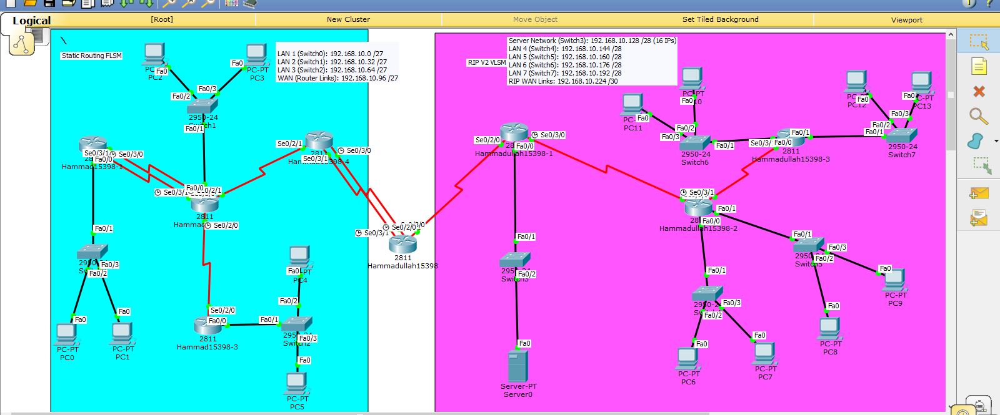

# IIA Assignment 1: Central DHCP Server with Static Routing and RIP v2

## Topology

A multi-branch network with a central router and one central DHCP server (`Server0`). The network has two zones (shown in different colours in the topology):

- a **static routing** zone
- a **dynamic routing** zone using **RIP version 2**

## What was done
- Designed the subnets and configured the interfaces of all routers
- Configured static routes in the static zone and RIP v2 in the dynamic zone, then checked the routing tables with `show ip route`
- Configured the central DHCP server with a separate pool for each LAN
- Configured **DHCP relay** (`ip helper-address`) on the routers so PCs in other LANs can get addresses from the central server
- Verified that every PC (PC0 to PC13) received an address, mask and gateway by DHCP, and tested ping between PCs of different LANs

## Files
- [assignment1-report.pdf](assignment1-report.pdf): configurations and screenshots
- `iia-assignment1.pkt`: Packet Tracer file
