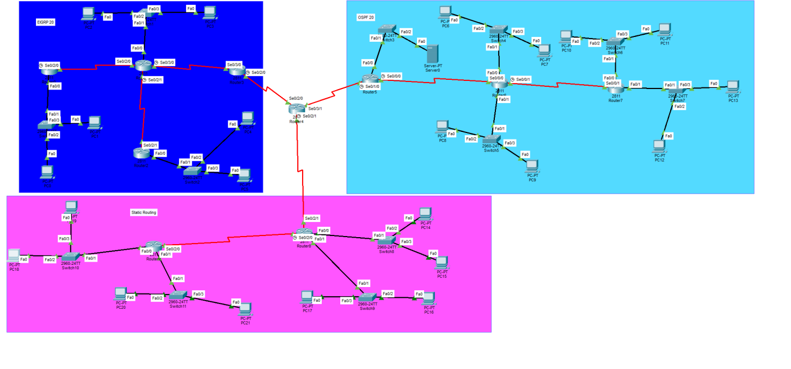

# IIA Assignment 2: OSPF, EIGRP and Static Routing with Redistribution and ACL

## Topology

A large network with three routing zones around a **core router (Router4)**:

| Zone | Routing |
|---|---|
| Static | Static routes |
| OSPF | OSPF |
| EIGRP | EIGRP |

## What was done
- Configured the three zones and checked the routing tables on all routers (`show ip route` with `O`, `D EX` and `S` routes)
- Performed **mutual redistribution** on the core router so all zones can reach each other
- Set up a web server (HTTP) and applied an **extended ACL on the core router** that blocks web access from the EIGRP zone while allowing all other traffic and inter-zone pings

## Verification
- Web page opens from a PC in the **static** zone and from a PC in the **OSPF** zone
- Web access from the **EIGRP** zone is denied by the ACL
- Ping from the EIGRP zone still works

## Files
- [assignment2-report.pdf](assignment2-report.pdf): routing tables, ACL and test screenshots
- `iia-assignment2.pkt`: Packet Tracer file
