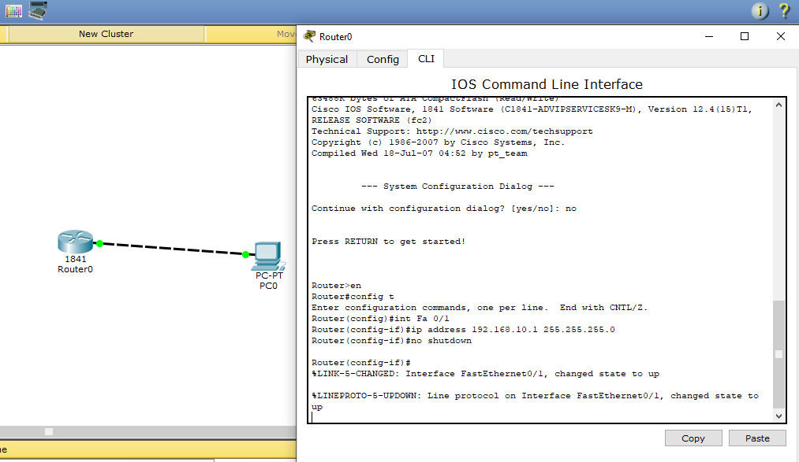

# IIA Lab 1: Router Basics and CLI

## Topology

One Cisco 1841 router (Router0) connected to a PC (PC0).

## What was done
- Opened the router CLI and moved through the modes: user EXEC (`Router>`), privileged EXEC (`enable`), global configuration (`configure terminal`) and interface configuration
- Configured the FastEthernet interface with an IP address and subnet mask and brought it up with `no shutdown`:
  - `interface FastEthernet0/1`
  - `ip address 192.168.10.1 255.255.255.0`
  - `no shutdown`
- Checked a Windows PC with `ipconfig` and tested connectivity with `ping`
- Theory points: startup configuration is stored in NVRAM, `ping` checks connectivity between two devices, and a serial port on a 2800-series router needs a WIC-2T module

## Files
- [lab1-report.pdf](lab1-report.pdf): report with screenshots
- `iia-lab1-router-basics.pkt`: Packet Tracer file
