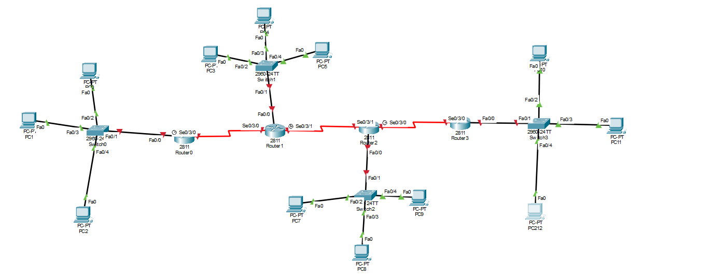

# IIA Lab 10: OSPF with NAT and ACL

## Topology

Four routers (Hammad_15398_R0 to R3) with LANs and PCs behind them. Router0 is the edge router where NAT and the ACL are configured.

## What was done
- Enabled OSPF on all routers (`router ospf 10`, `network ... area 0`)
- On Router0:
  - Created a standard ACL (`access-list 1 permit 192.168.1.0 0.0.0.255`) to select the inside addresses
  - Created a NAT pool and enabled dynamic NAT (`ip nat pool`, `ip nat inside source list 1 pool ...`)
  - Marked the interfaces with `ip nat inside` and `ip nat outside`
  - Cleared old translations with `clear ip nat translation *`
- Tested connectivity from the PCs with ping (replies received, with the first packet timing out while ARP and routes settle)

## Files
- [lab10-report.pdf](lab10-report.pdf): configuration and ping tests
- `iia-lab10-ospf-nat-acl.pkt`: Packet Tracer file
