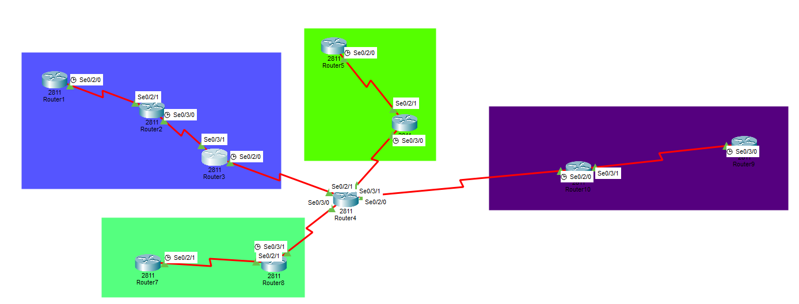

# IIA Lab 11: Mixed Routing Protocols and Redistribution

## Topology

A core router (Router4) connects four routing zones, each using a different method:

| Zone | Routers | Routing |
|---|---|---|
| Static | Router1, Router2, Router3 | Default static routes (`ip route 0.0.0.0 0.0.0.0 <next hop>`) |
| RIP v2 | Router5, Router6 | `router rip`, `version 2`, `network 172.16.0.0` |
| EIGRP | Router7, Router8 | `router eigrp 15398`, `network 10.0.0.0`, `no auto-summary` |
| OSPF | Router9, Router10 | `router ospf 15398`, `network 11.1.x.0 0.0.0.3 area 0` |

## What was done
- Configured each zone with its own method and checked that EIGRP and OSPF neighbors come up
- On the **core router (Router4)** ran RIP, EIGRP and OSPF together, added static routes for the static zone, and **redistributed** routes between all of them (`redistribute rip / eigrp / ospf / static` with metrics) so every zone can reach every other zone
- Tested end-to-end connectivity with ICMP (for example Router1 to Router10, and Router7 to Router, all `Successful`)

## Files
- [lab11-report.pdf](lab11-report.pdf): configuration of each router and the ICMP results
- `iia-lab11-redistribution.pkt`: Packet Tracer file
