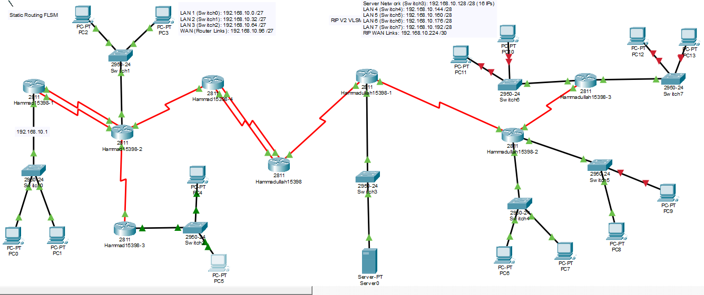

# IIA Lab 12: Multi-Branch Network with FLSM, VLSM, Static Routing and RIP v2

## Topology

A corporate network with a headquarters that has a central DHCP server and several branches. The network is split into two zones:

- **Static routing zone (FLSM):** fixed-length `/27` subnets with manually configured static routes
- **Dynamic routing zone (VLSM + RIP v2):** variable-length subnets (`/28` LANs and `/30` links) with RIP version 2

## IP plan (192.168.10.0)

| Network | Subnet | Mask | Devices |
|---|---|---|---|
| LAN 1 | 192.168.10.0/27 | 255.255.255.224 | PC0, PC1 |
| LAN 2 | 192.168.10.32/27 | 255.255.255.224 | PC2, PC3 |
| LAN 3 | 192.168.10.64/27 | 255.255.255.224 | PC4, PC5 |
| WAN (FLSM links) | 192.168.10.96/27 | 255.255.255.224 | Router-to-router serial links |
| Server network | 192.168.10.128/28 | 255.255.255.240 | Server0 (DHCP) |
| LAN 4 | 192.168.10.144/28 | 255.255.255.240 | PC6, PC7 |
| LAN 5 | 192.168.10.160/28 | 255.255.255.240 | PC8, PC9 |
| LAN 6 | 192.168.10.176/28 | 255.255.255.240 | PC10, PC11 |
| LAN 7 | 192.168.10.192/28 | 255.255.255.240 | PC12, PC13 |
| WAN (RIP v2 links) | 192.168.10.224/30 | 255.255.255.252 | Dynamic-zone point-to-point links |

## What was done
- Subnetted `192.168.10.0` with FLSM and VLSM
- Configured interfaces and static routes in the static zone, and RIP v2 in the dynamic zone
- Set up a **central DHCP server** (`Server0`, `192.168.10.130`, gateway `192.168.10.129`) with separate pools for LAN 4 to LAN 7
- Checked that PCs receive addresses by DHCP and that PCs can ping across both zones

## Files
- [lab12-report.pdf](lab12-report.pdf): scenario description, IP plan and screenshots
- `iia-lab12-flsm-vlsm.pkt`: Packet Tracer file
