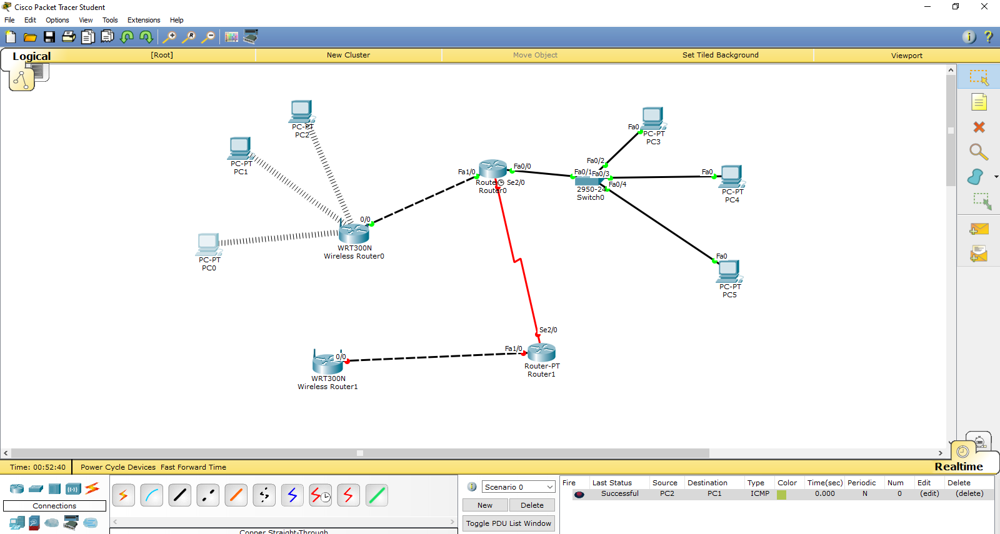

# IIA Lab 2: DHCP and Wireless Routers

## Topology

A router (Router0) with a switch and three wired PCs, a serial link to a second router (Router1), and two WRT300N wireless routers. Wireless PCs connect to the wireless routers.

## What was done
- Configured a DHCP pool on the router's FastEthernet interface:
  - pool name `hammad`, network `30.30.30.0 255.255.255.0`, default gateway `30.30.30.1`
- Switched the wired PCs to DHCP (for example PC3 received `30.30.30.2`)
- Connected the wireless PCs to the wireless router using **WPA-Personal with AES** and a pre-shared key
- Tested connectivity between PCs with ICMP (successful in the PDU list)

## Files
- [lab2-report.pdf](lab2-report.pdf): report with screenshots
- `iia-lab2-dhcp-wireless.pkt`: Packet Tracer file
