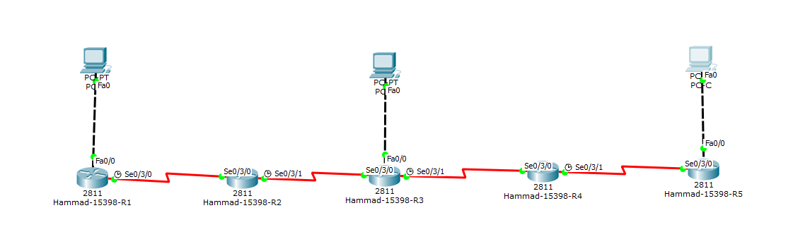

# IIA Lab 3: Static Routing

## Topology

Five Cisco 2811 routers (Hammad-15398-R1 to R5) connected in a chain with serial links. Each end of the chain has a PC LAN (PC-A, PC-B, PC-C).

## What was done
- Configured IP addresses on the LAN and serial interfaces of all five routers
- Set the clock rate on the DCE serial interfaces
- Added static routes (`ip route <network> <mask> <next hop>`) on every router so that every LAN can reach every other LAN
- Set static IPs and default gateways on the PCs (PC-A `192.168.1.10`, PC-B `192.168.3.10`, PC-C `192.168.5.10`)

## Verification
- `ping` between PCs on different LANs gets replies once the routes are in place
- `tracert 192.168.5.10` from PC-A shows the path through all routers: `192.168.1.1`, `10.1.1.2`, `10.2.2.2`, `10.3.3.2`, `10.4.4.2`, `192.168.5.10`

## Files
- [lab3-report.pdf](lab3-report.pdf): configuration and ping screenshots
- `iia-lab3-static-routing.pkt`: Packet Tracer file
