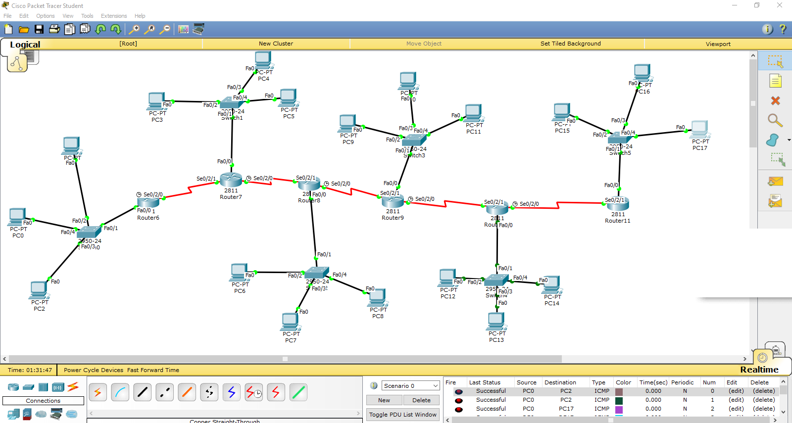

# IIA Lab 4: Multi-Router Network Connectivity

## Topology

Six Cisco 2811 routers (Router6 to Router11) connected in a chain with serial links. Each router has a 2950-24 switch with PCs (PC0 to PC17, 18 PCs in total).

## What was done
- Built the topology and configured the router interfaces and the PCs
- Tested connectivity between PCs on different routers using ICMP packets and the PDU list (for example PC0 to PC2, and PC0 to PC17 show `Successful`)

## Files
- [lab4-report.pdf](lab4-report.pdf): topology and PDU list
- `iia-lab4-multi-router.pkt`: Packet Tracer file
