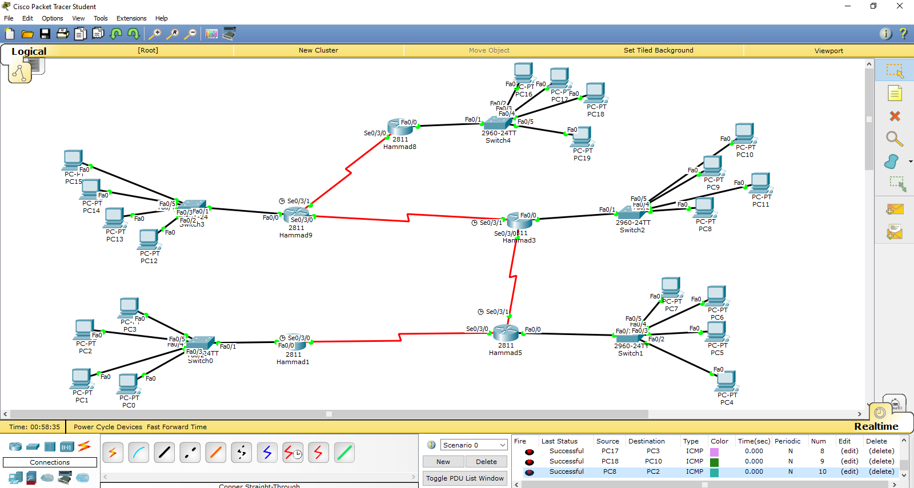

# IIA Lab 5: Dynamic Routing with RIP v2

## Topology

A multi-router network (Hammad1 to Hammad9 and others) with serial links between routers and PC LANs behind them.

## What was done
- Configured IP addresses and serial links on all routers
- Enabled RIP version 2 on each router:
  - `router rip`
  - `version 2`
  - `no auto-summary`
  - `network <connected networks>`
- Checked the learned routes with `show ip route` (routes marked `R`)
- Tested connectivity between PCs on different LANs with ICMP (all `Successful` in the PDU list)

## Files
- [lab5-report.pdf](lab5-report.pdf): router configuration and verification screenshots
- `iia-lab5-rip.pkt`: Packet Tracer file
