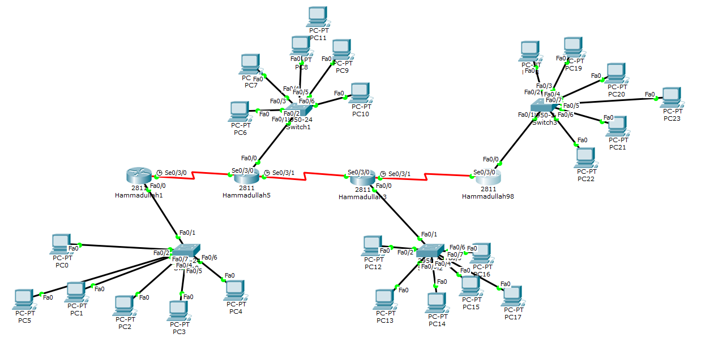

# IIA Lab 6: Dynamic Routing with EIGRP

## Topology

A chain of Cisco 2811 routers with a switch and PCs on each router (PC0 to PC23).

## What was done
- Configured IP addresses and serial links (DCE clock rate on the serial interfaces)
- Enabled EIGRP on every router:
  - `router eigrp 15398`
  - `network <network> <wildcard mask>`
  - `no auto-summary`
- Confirmed neighbor adjacencies (`IP-EIGRP 15398: Neighbor ... is up: new adjacency`)
- Tested connectivity between PCs on different routers with ICMP (`Successful` in the PDU list)

## Files
- [lab6-report.pdf](lab6-report.pdf): router configuration and PDU list
- `iia-lab6-eigrp.pkt`: Packet Tracer file
