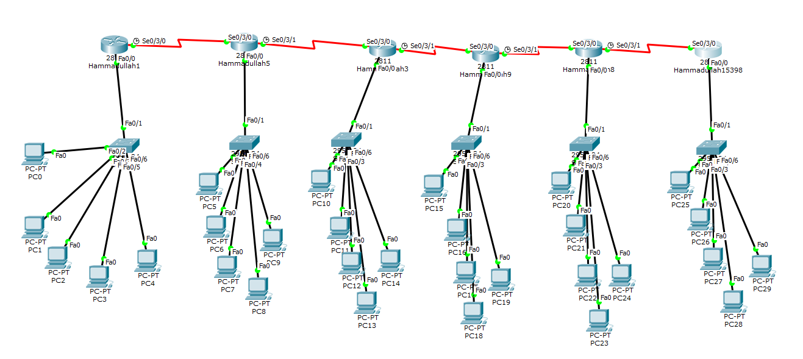

# IIA Lab 7: Dynamic Routing with OSPF

## Topology

Six routers connected in a chain with serial links. Each router has a LAN with PCs (PC0 to PC29).

## What was done
- Configured IP addresses on the LAN and serial interfaces
- Enabled single-area OSPF (area 0) on every router:
  - `router ospf 15398`
  - `network <network> <wildcard mask> area 0`
- Confirmed OSPF neighbors reaching the **FULL** state (`%OSPF-5-ADJCHG ... from LOADING to FULL`)
- Tested connectivity between PCs on different routers with ICMP (PDU list in the report)

## Files
- [lab7-report.pdf](lab7-report.pdf): router configuration and verification screenshots
- `iia-lab7-ospf.pkt`: Packet Tracer file
