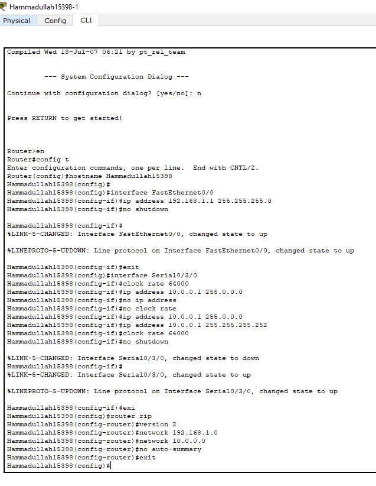

# IIA Lab 8: Extended ACL with an FTP Server

## Topology


Two routers (Hammadullah15398-1 and Hammadullah15398-2) connected with a serial link. The first LAN has PCs and an FTP server (`192.168.1.10`). The second LAN (`172.16.1.0/24`) has PC3, PC4 and PC5.

| Interface | Address |
|---|---|
| Router 1 Fa0/0 | 192.168.1.1/24 |
| Router 1 Se0/3/0 | 10.0.0.1/30 |
| Router 2 Se0/3/0 | 10.0.0.2/30 |
| Router 2 Fa0/0 | 172.16.1.1/24 |

## What was done
- Configured the interfaces, the DCE clock rate and **RIP version 2** (`no auto-summary`) so both LANs can reach each other
- Turned on the FTP service on the server and created a user account with read/write/delete/rename/list permissions
- Created an **extended access list** on Router 2 and applied it inbound on its LAN interface:
  - permit TCP from `172.16.1.0/24` to the FTP server on ports 21 and 20
  - deny every other IP traffic from that network to the server
  - permit all other traffic

```
access-list 101 permit tcp 172.16.1.0 0.0.0.255 host 192.168.1.10 eq 21
access-list 101 permit tcp 172.16.1.0 0.0.0.255 host 192.168.1.10 eq 20
access-list 101 deny ip 172.16.1.0 0.0.0.255 host 192.168.1.10
access-list 101 permit ip any any
interface FastEthernet0/0
 ip access-group 101 in
```

## Result
From **PC3**, `ftp 192.168.1.10` connects, logs in and lists the files, while `ping 192.168.1.10` fails with 100% loss. FTP is allowed and everything else to the server is blocked.

## Files
- [lab8-report.pdf](lab8-report.pdf): configuration and test screenshots
- `iia-lab8-acl-ftp.pkt`: Packet Tracer file
