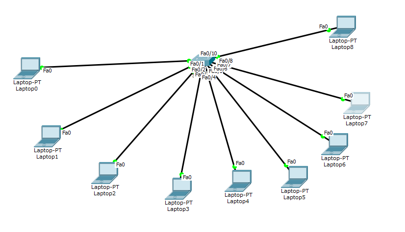

# IIA Lab 9: Switch Port Security

## Topology

One switch with nine laptops connected on its FastEthernet ports. One laptop later acts as the "attacker".

## What was done
- Configured the access ports with port security:
  - `switchport mode access`
  - `switchport port-security`
  - `switchport port-security maximum 1`
  - `switchport port-security mac-address sticky`
  - `switchport port-security violation shutdown`
- Unused ports were left administratively down
- Verified with `show port-security`, `show port-security interface fa0/1` and `show port-security address`
- Tested the security: the legitimate laptop pings normally, then a different device ("attacker") is connected to a secured port

## Result
The attacker's pings fail (100% loss). The switch reports a security violation, and the port goes into the **secure-shutdown** state with the violation count increased (screenshots in the report).

## Files
- [lab9-report.pdf](lab9-report.pdf): configuration, verification and attack test
- `iia-lab9-port-security.pkt`: Packet Tracer file
